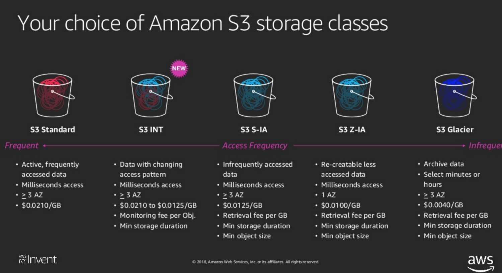
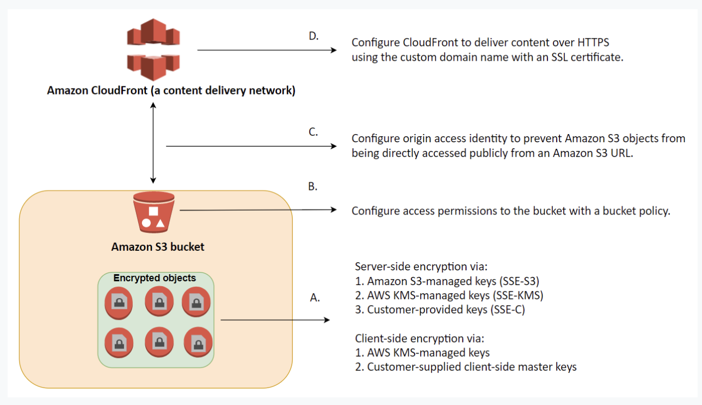

S3 (Simple Storage Service)
===

대용량의 파일 저장을 EC2와 EBS를 통해 구축하는 것 대비 
 -> 저렴한 비용, 무제한 용량, 파일 저장에 최적화

HTTP 프로토콜 통신이 가능하기 떄문에, 정적 데이터 제공하는 일에 뛰어나다.
S3자체가 뛰어난 성능의 웹 서버로 구성되어 있어, EC2와 EBS 구축 보다 auto scaling과 load balancing으로부터 자유로움

## access points
- s3에 데이터를 저장하는 AWS service나 유저 애플리케이션을 위한 데이터 액세스를 간편화하는 기능이다.
- GetObject, PutObject 등의 s3 object operations를 수행하기 위한 버킷에 붙일 수 있는 명명된 네트워크 엔드포인트이다.
- 각 액세스 포인트에는 해당 액세스 포인트를 통해 이루어지는 모든 요청에 대해 s3가 적용하는 고유 권한 및 네트워크 제어를 갖고 있다.
  - 버킷 정책과 함꼐 동작하는 사용자 지정 엑세스 포인트 정책을 적용할 수 있다.
  - VPC의 요청만 수락하도록 모든 엑세스 포인트를 구성하여 프라이빗 네트워크에 대한 s3 데이터 액세스를 제한할 수도 있다.
  - 각 액세스 포인트에 퍼블릭 액세스 제한을 커스텀할 수도 있다.
- **Multi-Region 액세스 포인트**도 구성 가능.
  - 혼잡한 퍼블릿 인터넷을 통한 요청이 아닌, 인터넷 기반 요청을 S3로 가속하여 내장된 네트워크 복원력을 제공. 멀리 리전 액세스 포인트 글로벌 엔드포인트에 대한 애플리케이션 요청은 **AWS Global Accerlerator**를 사용하여 AWS 글로벌 네트워크를 통해 네트워크 지연시간이 가장 짧은 S3 버킷으로 자동 라우팅된다.

## S3 Object Lock,
- Object lock은 무제한적 또는 고정된 횟수 동안 오브젝트가 삭제되거나 덮어씌여지지 않도록 제한할 수 있다.
- 하여 WORM(write-once-read-many) 스토리지 규율을 요구하거나 오브젝트의 변경/삭제를 보호하기 위한 보호 레이어를 간단하게 추가하는 것이 가능하다.
- Object Lock 기능은 버킷을 생성할때 활성화할 수 있으며, 활성화한 경우 이후 Object Lock기능을 다시 비활성 처리하거나 버전 관리를 일시 중단 할 수는 없다.
- Two retention modes
  - Governance mode
    - 일반 유저는 오브젝트 버전을 제거하거나 lock 설정을 변경할 수 없다.
    - 다만, 일부 유저에게 필요하다면 권한을 주어 제어가 가능하도록 할 수도 있다.
    - 거버넌스 모드를 사용하여 compliance-mode retention period를 생성하기 전에 retention period 셋팅을 테스트해볼 수 있기도 하다.
    - 거버넌스 모드를 변경/제거하기 위해서 유저는 `s3:BypassGoveranceRetention` 권한을 반드시 가지고 있어야 하고 명시적으로 거버넌스 모드 오버라이드 요청에는 리퀘스트 헤더에 `x-amz-bypass-governance-retention:true` 를 포함하여야 한다.
  - Compliance mode
    - 루트 유저를 포함하여 어느 유저도 오브젝트를 변경/제거할 수 없다.
    - 한번 compliance mode로 보호되면 절대 retention mode를 변경할 수도 없고 period도 짧게 조정할 수도 없다. 
    - 무조건 최초의 설정과 기간을 지켜야하는 것.
- Legal Hold vs Retention Period
  - Object lock을 이용하여 Legal Hold를 오브젝트 버전에 지정할 수 있으며 retention period처럼 해당 오브젝트 버전의 변경/제어를 보호할 수 있다. 그러나 리걸 홀드는 retention period와는 관계가 없으며 제거하지 전까지 계속 효과가 유지된다.
  - 리걸 홀드는 `s3:PutObjectLegalHold` 권한이 있는 유저라면 자유롭게 지정할 수도 제거 될수도 있다.
  - Legal hold는 retention period와는 독립적이다. 버킷이 오브젝트 락이 활성화되어 있는 오브젝트를 갖고 있는 , 특정 오브젝트가 retention period를 갖고 있든 아니든 리걸 홀드를 지정 및 제거가 가능하다. 리걸 홀드를 오브젝트 버전에 적용하는 것은 해당 오브젝트 버전의 retention mode/period에는 영향이 없다. retention period와 리걸 홀드를 모두 갖고 있는 특정 오브젝트 버전에서 retention period가 끝나더라도 리걸 홀드는 그대로 유효하다. 반대의 경우도 마찬가지. 둘은 독립적 관계이므로.

## S3 Storage Classes

- S3 Standard: General purpose
- S3 Intelligent-Tiering: Unknown or chaning access
- S3 Standard-Infrequent Access (S3 Standard-IA): Infrequent access
- S3 Zone-Infrequent Access (S3 One Zone-IA): Infrequent access, non-critical data
- S3 Glacier: Archive
- S3 Glacier Deep Archive: Archive, lowest-cost 

## S3 Intelligent-Tiering


- a New Amazon S3 Storage Class designed for customers who want to optimize storage costs automatically when data access patterns change, without performance impact or operational overhead. S3 Intelligent-Tiering is the first cloud object storage class that delivers automatic cost savings by moving data between two access tiers --frequent access and infrequent access-- when access pattern change, and is ideal for data with unknown or changing access patterns.
- S3 Intelligent-Tiering stores objects in two access tiers:
    -  one tier that is optimized for frequent access and another lower-cost tier that is optimized for infrequent access.
    - For a small monthly monitoring and automation fee per object, S3 Intelligent-Tiering monitors access patterns and moves objects that have not been accessed for 30 consecutive days to the infrequent access tier. There are no retrieval fees in S3 Intelligent-Tiering.
    - If an object inthe infrequent access tier is accessed later, it is automatically moved back to the frequent access tier. No additional tiering fees apply when objects are moved between access tiers within the S3 Intelligent-Tiering storage class. S3 Intelligent-Tiering is designed for 99.9% availability and 99.999999999% durability, and offers the same low latency and high throughput performance of S3 Standard.
- Amazon S3 features including S3 Object Tagging, S3 Cross-Region Replication, and S3 Select all work with S3 Intelligent-Tiering. Customers can start using S3 Intelligent-Tiering through the S3 API, CLI, and management console by putting objects directly into S3 Intelligent-Tiering or by using a S3 Lifecycle policy to move objects from S3 Standard or S3 Standard-IA to S3 Intelligent-Tiering. Customers can also archive obejcts with a S3 Lifecycle policy from S3 Intelligent-Tiering into Amazon S3 Glacier.
- S3 Intelligent-Tiering charges a small tiering fee and has a minimum eligible object size of 128KB for auto-tiering. Smaller objests may be stored but will always be charged at the Frequent Access tier rates.

## Pre-Signed URLs

- In Amazon S3, all objects are private by default. Only the object owner has permission to access these objects. 
- However, the object owner can optionally share objects with others **by creating a pre-signed URL**, using their own security credentials, **to grant time-limited permission to download the objects**.
- When you create a pre-signed URL for your object, you must provide your security credentials, specify a bucket name, an object key, specify the HTTP method (GET to download the object) and expiration date and time. The pre-signed URLs are valid only for the specified duration.
- Anyone who receives the pre-signed URL can then access the object. For example, if you have a video in your bucket and both the bucket and the object are private, you can share the video with others by generating a pre-signed URL.
- Let's think about this scenario
    - Your customer has clients all across the globe that access product files stored in several S3 buckets, which are behind each of their own CloudFront web distributions. They currently want to deliver their content to a specific client, and they need to **make sure that only that client can access the data**. Currently, **all of their clients can access their S3 buckets directly using an S3 URL** or **through their CloudFront distribution**.
    - To securely serve this private content by using CloudFront, you can do the following:
        - Require that your users access your private content by using special CloudFront signed URLs or signed cookies.
        - Require that your users access your Amazon S3 content by using CloudFront URLs, not Amazon S3 URLs. Requring CloudFront URLs isn't necessary, but **it is recommended to prevent users from bypassing the restrictions that you specify in singed URLs or signed cookies**.
        -  How to restrict access and prevent users from bypassing the restrictions by simply using the direct S3 URLs.
        - All objects and buckets by default are private. **The presigned URLs are useful if you want your user/customer to be able to upload a specific object to your bucket, but you don't require them to have AWS security credentials or permissions**. YOu can generate a presigned URL programmatically using the AWS SDK for Java or the AWS SDK for .NET. If you're using Microsoft Visual Studio, you can also use AWS Explorer to generate a presigned object URL without writing any code. Anyone who receives a valid presigned URL can then programmatically upload an object.
        - **signed cookies** or **signed URLs** can ensure that only their client can access the files but the users can still bypass the restrictions in CloudFront by simply connecting to the direct S3 URLs.
        -  **Origin Access Identity (OAI)** will require your client to access the files only by using the CloudFront URL and not through a direct S3 URL. This can be a possible solution if it mentions the use of Signed URL or Signed Cookies.

## signed cookies
-  Singed cookies feaure is primarily used if you want to provide access to multiple restricted files.
    - for example, all of the files for a video in HLS format or all of the files in the subscribers' area of website.
-  In addition, this solution is not complete since the users can bypass the restrictions by simply using the direct S3 URLs.

## Avoiding accidental deletion in Amazon S3 bucket
- Enable **Versioning**
    - Versioning is a means of keeping multiple variants of an object in the same bucket.
    - You can use versioning to preserve, retrieve, and restore every version of every object stored in Amazon S3 bucket.
    - With versioning, you can easily recover from both unintended user actions and application failures.
- Enable **MFA(Multi-Factor Authentication)** Delete
    - If the MFA Delete is enabled, it requires additional authentication for either of the following operations:
        - Change the versioning state of your bucket
        - Permanently delete an object version

## Basic conecept
> Object(객체): S3에 데이터가 저장되는 최소 단위. file과 meta 데이터로 구성  
- Key(객체의 이름), value(객체의 데이터)  
- 객체 하나의 크기: 1byte ~ 5TB  
- meta data는 HTTP Content-Type 형식(MIME)이다. 파일의 확장자에 따라 자동으로 설정되며 임의로 설정할 수도 있다.  
- key-value 형식이며 S3 전용 메타데이터 및 사용자 정의 메타데이터도 저장된다.  
> Bucket: S3에서 생성할 수 있는 최상위 디렉토리. 버킷은 Region별로 생성해야함. 단, 버킷의 이름은 모든 S3 Region 중에서 유일해야 한다.
- 버킷안에 객체가 저장됨
- 디렉토리 생성이 가능(실제로는 객체 이름이 디렉토리 경로까지 포함)
- 저장 가능한 객체의 개수는 무제한
- 저장 가능한 용량 무제한
- 접속 제어 및 권한 관리가 가능
- URL로 접근이 가능.
ex) http://examplebucket.s3.amazonaws.com/helloworld.png -> examplebuck: 버킷 / helloworld.png: 객체

> 내구성과 가용성: 1년 기준 내구성 99.999999999%, 가용성 99.99%  
- ※내구성 - 데이터가 유실되지 않는 것. 가용성 - 언제나 정상적으로 사용가능한 상태  

> 요금: 저장 용량, 데이터 전송량, HTTP Request 개수로 책정  

## S3 Storage Class
> Standard Storage(표준 스토리지)  
- 99.999999999% 내구성을 가지고 있어 그만큼 요금도 높다. 유실되면 안돼는 데이터 저장에 권장
> RRS, Reduced Redunancy Storage(낮은 중복 스토리지)  
- Standard Storage보다 낮은 99.99%의 내구성  
- 이름 그대로 데이터를 복제한 사본의 수를 줄여 비용을 낮추었기 때문에 요금이 저렴 - 20%정도(2014년 8월 기준)  
- 원본 데이터를 다른 곳에 가지고 있거나, 동영상이나 이미지의 썸네일 등 원본에서 다시 생성할 수 있는 데이터에 적합

## S3 static website hosting  
- S3를 정적 웹사이트 호스팅을 하지 않더라도, 기본적으로 웹브라우저로 접근할 수 있지만, 차이가 있음
- S3의 일반적인 URL 형태  
  >http://s3-\<region name\>.amazonaws.com/\<bucket name\>/\<file name\>  
- 정적 웹사이트 호스팅을 사용한 S3의 URL 형태(S3 Website Endpoint라고 부름)  
  >http://\<bucket name\>.s3-website-\<region name\>.amazonaws.com/\<file name\>  
- 버킷 이름이 서브 도메인 형태로 들어가야 DNS 서버에서 CNAME 설정이 가능. 즉, example.com 도메인의 CNAME을 examplebucket7.s3-website-ap-northeast-1.amazonaws.com으로 설정하면 example.com으로 접속했을 때, examplebucket7의 내용이 바로 표시 된다.  
- CNAME의 설정은 AWS의 **Route53**에서 설정 또는, BIND와 같은 일반적인 DNS 서버에서도 가능.  
- 정적 웹사이트 호스팅 설정을 이용하면 인덱스 페이지와 에러 페이지의 파일명을 따로 지정해줄 수 있고, 다양한 redirection 행동이 가능. 즉, examplebucket7.s3-website-ap-northeast-1.amazonaws.com과 같은 다른 도메인으로 redirection 가능.  
- ※JQuery, Bootstrap 등의 Javascript libraries 파일은 EC2에서 웹 서버를 구축하여 서비스하는 것보다 S3 static website hosting을 활용하여 서비스하는 것이 유리. 또한 image나 css파일 등에도 효과적.

## How to do S3 static website hosting
1. 해당 버킷의 권한 설정을 완료하기
 AWS Policy Generator로 해당 버킷 이하의 제공 컨텐츠에 대하여 effect, principal(정책 적용 대상, 인터넷 전체에 공개하는 경우 asterisk *), action, resource, condition 등을 설정
2. 해당 버킷의 Properties에서 Static Website Hosting 탭에서 Enable website hosting 체크.
3. Index document, Error document, Edit redirection rules 등 세부사항 지정
4. 접근 url은 해당 index 객체의 properties의 static website hosting에 endpoint를 이용

## Restricting Access to a Specific HTTP referer: 웹호스팅 되고 있는 S3 버킷에 대하여 원하는 도메인에서만 접근 가능하도록 제한하기
S3는 데이터 전송량에 따라 요금 책정하기 때문에 원하지 않는 도메인에서의 링크를 막는다면 그만큼 비용 절감이 가능.  
Http referer은 웹브라우저가 생성하는 HTTP 헤더값 데이터이다.  
ex) http://example.com 웹사이트에서 http://hello.com의 링크를 클릭하거나 \ 태그로 그림 파일을 보여줄 때, http://hello.com으로 보내는 HTTP 헤더의 Referer 값은 http://example.com이 된다. 따라서 링크를 어디서 클릭했느냐, 그림 파일을 어디서 보여줬느냐를 알 수 있다. S3에서는 이 Referer 값을 판단해서 보여줄지 말지 제한할 수 있다.  
\※주의: 해당 파일의 grantee가 everything으로 설정되어 있지는 않은지 확인
__bucket policy sample__
```JSON
    {
        "Version": "2018-01-14",
        "Id": "http referer policy example",
        "Statement": [
            {
                "Sid": "Allow get requests orginated from www.example.com and example.com",
                "Effect": "Allow", //지정한 도메인만 허용할 것이므로 Allow
                "Principal": "*", //정책을 적용할 대상. 인터넷 전체에 공개이므로 asterisk
                "Action": "s3:GetObject", //파일을 보여주는(다운로드) 상황이므로 s3:GetObject
                "Resource": "arn:aws:s3:::example7/*",
                "Condition": { //조건절. 조건에 맞으면 Allow 또는 Deny
                    "StringLike": { //조건절 안에 사용하는 조건문. 뜻은 문자열을 포함하고 있을때
                        "aws:Referer": "http://example7.s3-website-ap-northeast-1.amazonaws.com/*" //Referer값을 지정. /*을 넣어 해당 도메인 이하의 모든 경로에 대하여 허용. /index.html처럼 특정 파일만 지정도 가능. 여러 도메인 지정인 경우 comma로 구분
                    }
                }
            }
        ]
    }
```
## 암호화 사용 절차

1. 버킷 오브젝트 인크립션 - 서버사이드, 클라이언트 사이드 암호화
2. 버킷 레벨 - 버킷 정책과 access permission 설정
3. cloudfront와 bucket 연결 간 - s3 URL을 통하여 공개적으로 직접 오브젝트에 직접 접근하지 못하도록 origin access identity 설정
4. 클라우드 프론트 SSL certificate로 커스텀 도메인 네임을 사용하여 HTTPS로 content delivery 설정


## server-side encryption
- supports only AES-256. not AES-128
- 암호화 키 관리 방법에 따라 세 가지 상호 배타적인 옵션이 있다:
  - Amazon S3-Managed Keys(SSE-S3)
  - AWS KMS-Managed Keys(SSE-KMS)
  - Customer-Provided Keys(SSE-C)
## client-side encryption
- via
  - AWS KMS-managed keys
  - Customer-supplied client-side master keys