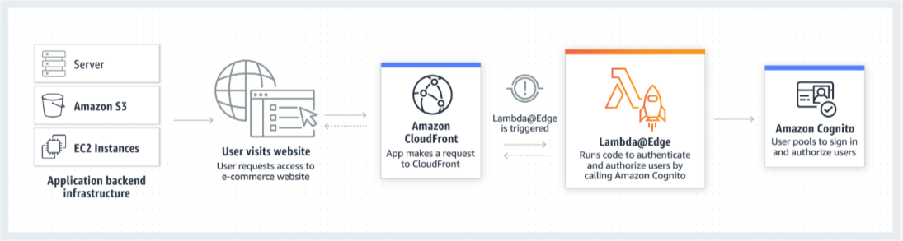

CloudFront
---

## Lambda@Edge

- a feature of Amazon CloudFront that lets you run code closer to users of your application, which improves performance and reduces latency.  
- With Lambda@Edge, you don't have to provision or manage infrastructure in multiple locations around the world.
- You pay only for the compute time you consume - there is no charge when your code is not running
- With Lambda@Edge, you can enrich your web applications by making them globally distributed and improving their performance - all with zero server administration.
- Lambda@Edge runs your code in reponse to events generated by the Amazon CloudFront content delivery network(CDN).
- Just upload your code to AWS Lambda, which takes care of everything required to run and scale your code with high availability at an AWS location closest to your end user.