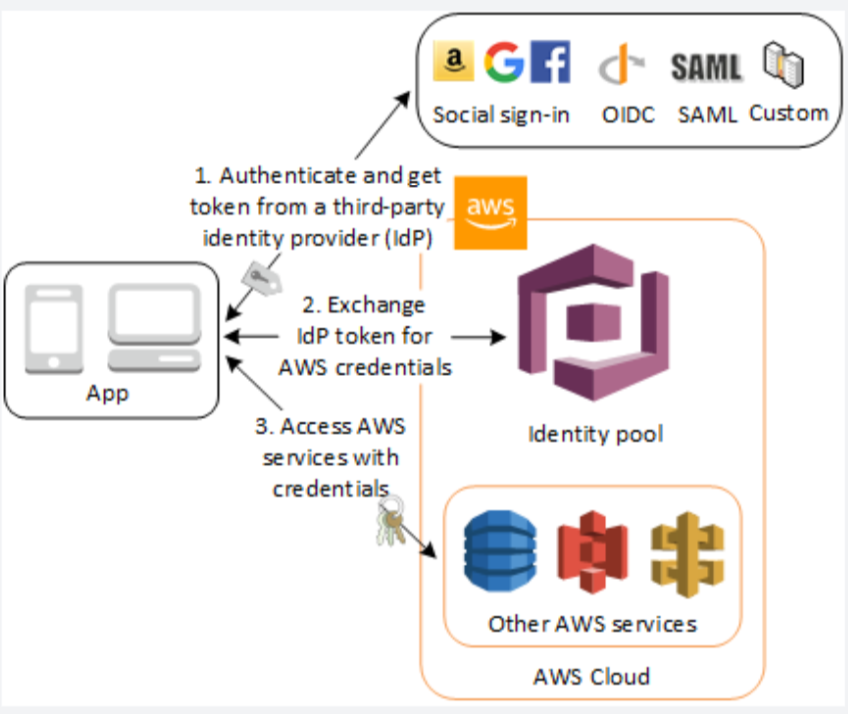

# AWS Congito

## What is it

- Amazon Cognito provides authentication, authorization, and user management for your web and mobile apps.
- Your users can sign in directly with a user name and password, or through a third party as FB, Amazon, Google.

## Two main components

- User Pools and Identity Pools
- User Pools
  - are user directories that provide sign-up and sign-in options for your app users.
- Identity Pools
  - enable you to grant our users access to other AWS services.
- You can use identity and user pools seperately or together.

## How it works

- Amazon Cognito identity pools (federated identities) support user authentication through Amazon Cognito user pools, federated identity providers(including Amazon, FB, Google, and SAML identity providers) as well as unauthenticated identities.
- This feature also supports `Developer Authenticated Identities (Idnetities Pools)`, which lets you register and authenticate users via your own back-end authentication process.
- **User Pools don't have an option to enable unauthenticated identities.** Moreover, you won't be able to provide your users access to upload their media files to S3 using a User Pool.