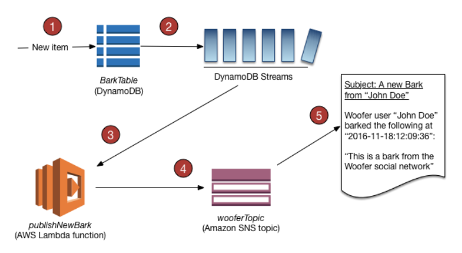

DynamoDB
---

## DynamoDB Streams

Amazon DynamoDB is integrated with AWS Lambda so that you can create *trigger* - pieces of code that automatically respond to events in DynamoDB Streams. With triggers, you can build applications that react to data modifications in DynamoDB tables.  
If you enable DynamoDB Streams on a table, you can associate the stream ARN with a Lambda function that you write. Immediately after an item in the table is modified, a new record appears in the table's stream. AWS Lambda polls the stream and invokes your Lambda function synchronously when it detects new stream records.