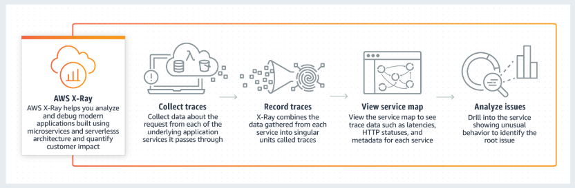

# AWS X-Ray

Helps developers analyze and debug production, distributed applications, such as those built using a microservices architecture.  
With X-Ray, you can understand how your application and its underlying services are performing to identify and troubleshoot the root cause of performance issues and errors. X-Ray provides an end-to-end view of requests as they travel through your application, and shows a map of your application's underlying components.

## Works with

- EC2, ECS, LAMBDA, Elastic Beanstalk
- Languages: Java, Nodejs, .NET applications

## Similar services
- Amazon Inspector: this is primarily used for EC2 and not for lambda