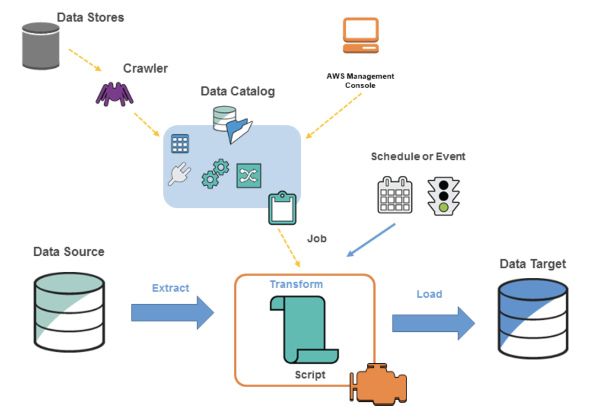

AWS Glue
---

- 여러 데이터 스토어 사이에서 데이터를 쉽게 옮길 수 있도록 하는 강력한 비용 효과적인 fully managed ETL service.
- S3, RDS, Redshift 등 다양한 원천 소스로부터 데이터를 옮기는 ETL 잡을 쉽게 생성하고 관리할 수 있다.
- 특히, Glue는 구체적 필요성에 맞도록 데이터를 변형할 수도 있다.
- 주요 장점으로는 **자동 스키마 디스커버리 및 맵핑 기능**인데 다양한 스키마의 다양한 소스 데이터를 쉽게 맵핑할 수 있도록 한다.

## Apache Parquet format(Performance oriented, column-based data format) support.
- 빅데이터 처리에 유용한 Apache Parquet 포멧 변형을 지원한다. .csv 파일을 Parquet 포멧으로 쉽게 컨버트하고 결과물을 S3 버킷에 저장할 수 있다.
- s3로부터 Parquet 파일이 포함된 bzip, gzip 아카이브를 쓰거나 읽을 수도 있음.

## Glue Crawler
- 크롤러가 실행되면 다음과 같은 작업을 수행하여 데이터 저장소를 조사한다.
- 데이터를 분류하여 원시 데이터의 형식, 스키마 및 관련 속성을 결정한다
  - 사용자 지정 classfier를 구성할 수도 있다.
- 데이터를 테이블 또는 파티션으로 그룹화한다.
  - crawler heuristics 기반으로 데이터를 그룹화한다.
- Data Catalog에 메타데이터를 쓴다.
  - 크롤러가 테이블과 파티션을 추가, 업데이트, 삭제하는 방법을 구성 가능.

  
## FYI,
- 다양한 소스로부터 이벤트를 받아 AWS Lambda를 이용하여 .csv -> parquet 변형을 하는 방법도 있겠으나 람다는 max execution time이 있기에 빅데이터를 핸들링하기에 유용하지 못하다. 타임아웃 이슈가 잔재한다. 하여 AWS Glue가 상대적으로 이러면에서는 효율적이다.

## EMR과 잘 비교해두자!
