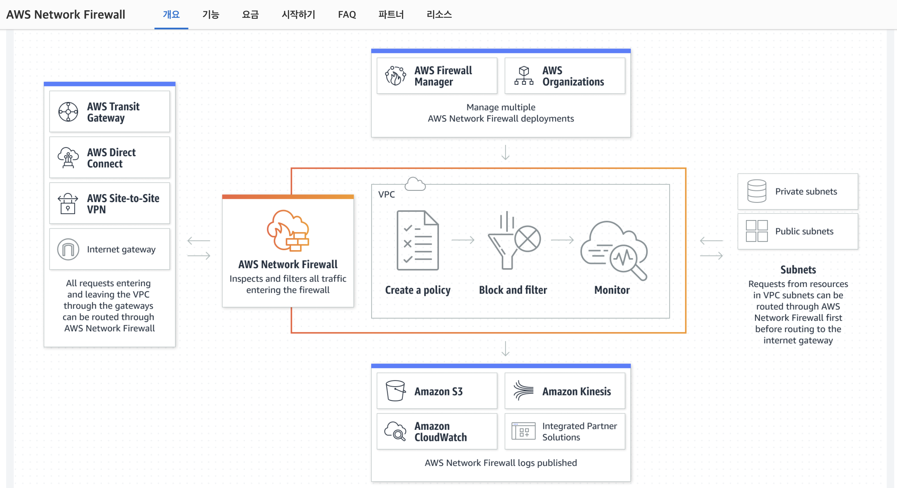

AWS Network Firewall
---

네트워크 파이워월을 사용하면 네트워크 트래픽을 세부적으로 제어하는 방화벽 규칙을 정의할 수 있다. 네트워크 파이워월은 AWS 파이어월 매니저와 연동되므로, Network Firewall 규칙을 기반으로 정책을 구축한 후 해당 정책을 중앙에서 VPC 및 계정 전반에 적용할 수 있다.  
Firewall 안으로 들어오는 모든 트래픽에 대한 inspection and filter가 가능하다.

- Network Firewall을 VPC의 경계(Perimeter of VPC)에 위치시켜 트래픽을 필터링할 수 있음.
  - Internet Gateway, NAT gateway, ovrer VPN or AWS Direct Connect 등으로부터의 in/out 트래픽 필터링을 포함.
- `Suricata`, Opensource IPS(Intrusion Prevention System)을 사용하여 stateful inspection. Suritaca 호환 rules도 지원.
- Domain name stateful network traffic inspection 지원.
  - stateful rules 엔진이 네트워크 트래픽에서 찾는 도메인 네임을 사용하여 Allow/Deny lists를 만들 수 있음.