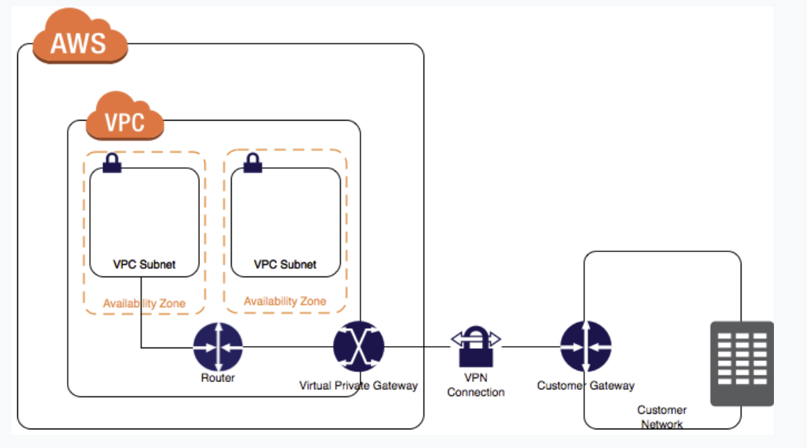

VPC
---

## Internet Gateway

### egress-only internet gateway
- a horiznetally scaled, redundant, and highly available VPC Component that allows outbound communication over IPv6 from instances in your VPC to the internet and **prevents it from initiating an IPv6 connection with your instances.**
- NAT Gateway와 구분: IPv6를 IPv4로 통역해주는 기능이 있는 것이지, 인바운드 IPv6 트래픽이 인스턴스에 도달하도록 막아주는 것은 아니다.

## NAT gateway
- has a NAT64 feature that translates an IPv6 address to IPv4.

## Virtual Private Gateway

- 기본적으로 VPC에 인스턴스를 띄우게 되면 자체 네트워크와 통신할 수 없기에, Virtual Private Gateway를 VPC에 붙이고 커스텀 라우팅 테이블을 만들고 시큐리티 그룹룰도 설정하고 AWS Managed VPC connection도 생성해야한다.
  - AWS에서 VPC Connection 용어의 의미는 VPC와 자체 네트워크 간의 커넥션을 일컫는다.
  - AWS는 인터넷 프로토콜 시큐리티(IPsec) VPN connections를 지원.
  - customer gateway는 고객의 자체 네트워크 사이드의 물리적 디바이스나 소프트웨어 애플리케이션을 일컫음.
  